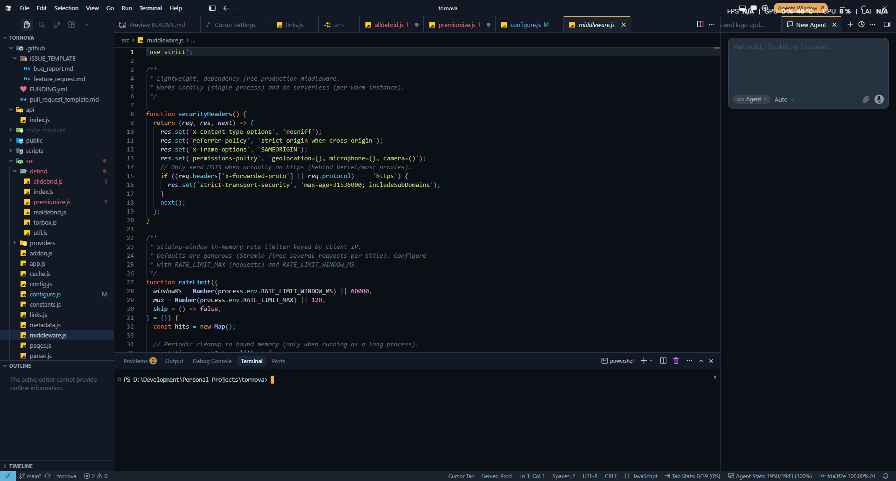
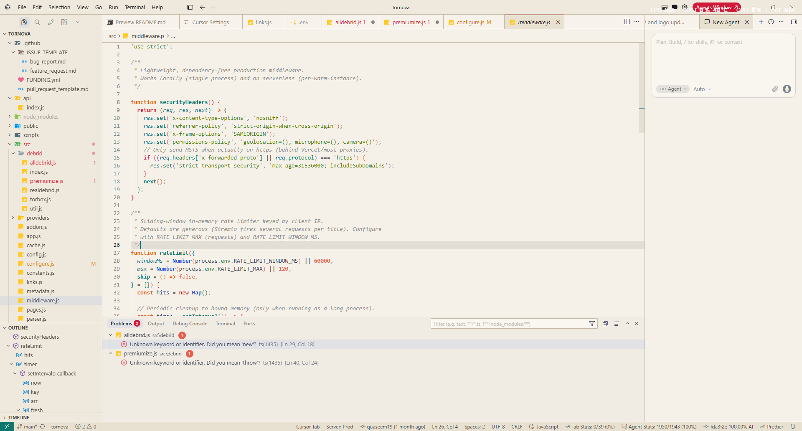

# Equinox

Paired **Dark** and **Light** color themes for VS Code and Cursor — smoked-glass night and warm parchment day.

## Variants

| Theme | Mood |
| --- | --- |
| **Equinox Dark** | Deep blue-graphite glass, gold actions, cool structure |
| **Equinox Light** | Soft parchment paper, high-chroma accents, warm git cues |

Both share the same semantic roles (actions → structure → data → docs → noise) and a single token → build pipeline.

## Install

### Marketplace

1. Extensions (`Ctrl+Shift+X` / `Cmd+Shift+X`)
2. Search **Equinox**
3. Install, then pick **Equinox Dark** or **Equinox Light** (`Ctrl+K Ctrl+T`)

### From VSIX

```bash
npm run package
```

Then **Extensions → ⋯ → Install from VSIX…** and choose the generated `.vsix`.

## Recommended settings

```json
{
  "editor.bracketPairColorization.enabled": true,
  "editor.guides.bracketPairs": true,
  "editor.semanticHighlighting.enabled": true
}
```

## Screenshots

**Equinox Dark**



**Equinox Light**



## Develop

```bash
npm install
npm run build
```

Press **F5** to open the Extension Development Host, then select the Equinox theme. Preview sample: `src/preview/syntax-sample.ts`.

Token sources live in `src/tokens/`. Do not hand-edit `themes/*.json` — always rebuild.

## License

MIT. See [LICENSE](LICENSE).
